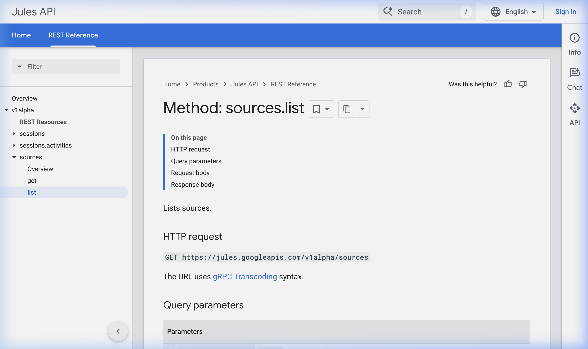

# VibeTask — Jira × Jules Integration

VibeTask is a premium, real-time bridge designed to connect **Jira Cloud** with **Google's Jules AI** coding agent. It enables developers to transform complex Jira issues into actionable coding tasks with a single click, providing a seamless workflow from project management to code implementation.



## 🚀 Key Features

- **Jira Live-Sync**: Browse and filter Jira tickets directly within the app using custom JQL support.
- **Context-Rich Prompting**: Automatically converts Jira ADF (Atlassian Document Format) into optimized text prompts, including descriptions and the latest comments for full agent context.
- **Real-Time Activity Feed**: Monitor Jules' progress with a granular activity feed that tracks execution plans, terminal output (bash logs), and file modifications.
- **Interactive Agent Refinement**: Send follow-up instructions or clarifications to the running Jules session through an integrated chat interface.
- **One-Click PR Generation**: Automatically trigger GitHub Pull Request creation once the agent completes the task.
- **Secure & Local**: Your Jira credentials and Jules API keys are stored exclusively in your browser's local storage—no backend database required.

## 🛠️ Tech Stack

- **Framework**: [Next.js 15+](https://nextjs.org)
- **Styling**: Tailwind CSS with a premium Dark Mode aesthetic.
- **Icons**: Lucide React
- **State Management**: Zustand with Persistence
- **API**: Integration with Jira Cloud REST API and Jules v1alpha API.

## 📥 Getting Started

### 1. Installation

Clone the repository and install dependencies:

```bash
npm install
```

### 2. Run Locally

Start the development server:

```bash
npm run dev
```

Open [http://localhost:3000](http://localhost:3000) in your browser.

### 3. Configuration

Click the **Settings (⚙️)** icon in the sidebar to configure:
- **Jira Domain**: `your-org.atlassian.net`
- **Jira Email**: Your Atlassian account email.
- **Jira API Token**: [Generate one here](https://id.atlassian.com/manage-profile/security/api-tokens).
- **Jules API Key**: Your Google Jules API key.

## 📝 License

MIT
